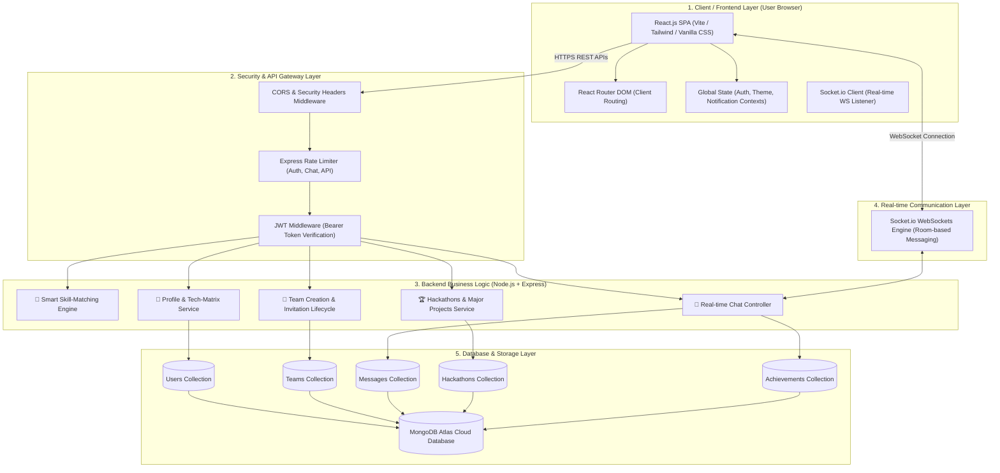
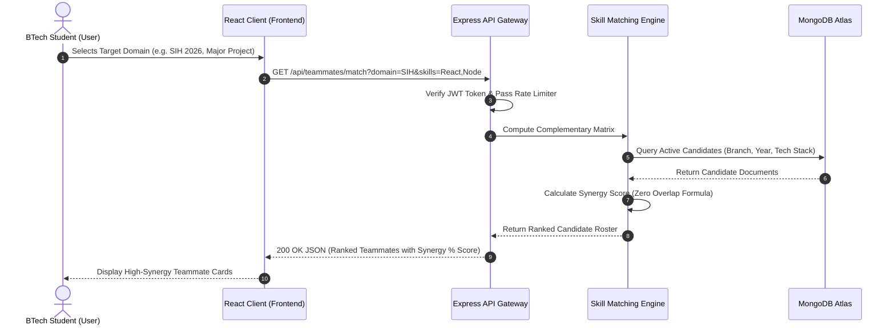
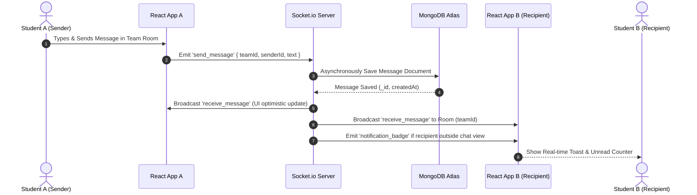
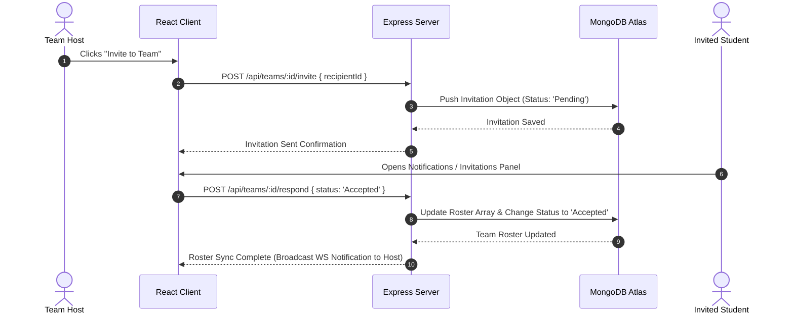

# 🏛️ TeamZen System Architecture & Technical Specifications

> **TeamZen** is an AI-powered BTech & college student teammate matching, hackathon squad finder, and campus project collaboration platform.
> 🌐 **Live Application:** [teamzenconnect.vercel.app](https://teamzenconnect.vercel.app/)

---

## 📋 Table of Contents
1. [System Architecture Diagram](#-system-architecture-diagram)
2. [System Sequence Diagrams](#-system-sequence-diagrams)
   - [A. Smart Teammate Matching Sequence](#a-smart-teammate-matching-sequence)
   - [B. Real-Time Room Chat & Notification Sequence](#b-real-time-room-chat--notification-sequence)
   - [C. Team Invitation Lifecycle Sequence](#c-team-invitation-lifecycle-sequence)
3. [Technology Stack & Ecosystem](#-technology-stack--ecosystem)
4. [Algorithm & Math Logic: Zero Skill-Overlap Engine](#-algorithm--math-logic-zero-skill-overlap-engine)
5. [Database Schemas & Data Model](#-database-schemas--data-model)
6. [API Architecture & Endpoints Reference](#-api-architecture--endpoints-reference)
7. [Security & Rate Limiting Infrastructure](#-security--rate-limiting-infrastructure)
8. [Deployment & Infrastructure Topology](#-deployment--infrastructure-topology)
9. [Intellectual Property & Ownership Notice](#-intellectual-property--ownership-notice)

---

## 📐 System Architecture Diagram



---

## 🔄 System Sequence Diagrams

### A. Smart Teammate Matching Sequence


### B. Real-Time Room Chat & Notification Sequence


### C. Team Invitation Lifecycle Sequence


---

## 🛠️ Technology Stack & Ecosystem

| Layer | Technology | Version | Purpose & Technical Justification |
|---|---|---|---|
| **Frontend Core** | React.js | `^18.2.0` | Declarative, component-driven SPA framework |
| **Build Tooling** | Vite | `^5.0.0` | Ultra-fast HMR and optimized production bundling |
| **Routing** | React Router DOM | `^6.20.0` | Client-side routing with protected layout wrappers |
| **Styling Systems** | Vanilla CSS + Tailwind | `^3.4.0` | Custom Glassmorphism tokens & atomic layout utilities |
| **Animations** | Framer Motion | `^10.16.0` | Hardware-accelerated UI transitions & spring physics |
| **Iconography** | Lucide React | `^0.300.0` | Accessible, tree-shakeable SVG icon collection |
| **Backend Runtime** | Node.js | `v18 LTS` | Non-blocking, event-driven I/O execution environment |
| **Web Framework** | Express.js | `^4.18.2` | Robust routing, middleware chaining & REST API design |
| **Real-time Protocol**| Socket.io | `^4.7.2` | Low-latency WebSockets with automatic fallback polling |
| **Database ODM** | Mongoose | `^8.0.0` | Strongly-typed schema modeling for MongoDB |
| **Authentication** | JSON Web Tokens | `^9.0.2` | Stateless HTTP Bearer authentication protocol |
| **Rate Limiting** | Express-Rate-Limit | `^7.1.5` | IP-based request throttling against DDoS & brute force |

---

## 🧮 Algorithm & Math Logic: Zero Skill-Overlap Engine

The core value proposition of TeamZen is forming **balanced engineering teams** without redundant skill overlaps.

### Synergy Match Score Formula
$$\text{Synergy Score} = \left( \frac{\text{Complementary Skills}}{\text{Total Required Skills}} \times 60 \right) + \left( \text{Branch Alignment Bonus} \times 20 \right) - \left( \text{Redundant Overlap Penalty} \times 20 \right)$$

### Engine Rules:
1. **Complementary Skill Weight (+60%):** Evaluates skills possessed by candidate that fill missing slots in the team's tech stack (e.g. Candidate has *Node.js + Express* while Team has *React + Figma*).
2. **Branch & Domain Synergy (+20%):** Rewards interdisciplinary alignment (e.g., CS + ECE for IoT/Hardware Hackathons, CS + IT for Major Projects).
3. **Redundant Overlap Penalty (-20%):** Deducts score if all members share identical primary skills (e.g. 4 Frontend developers with 0 Backend engineers).

---

## 🗄️ Database Schemas & Data Model

### 1. `User` Schema (`backend/models/User.js`)
```javascript
{
  name: { type: String, required: true },
  email: { type: String, required: true, unique: true, index: true },
  password: { type: String, required: true },
  college: { type: String, default: 'KNIT Sultanpur' },
  branch: { type: String, enum: ['CSE', 'IT', 'ECE', 'EE', 'ME', 'CE'] },
  yearOfStudy: { type: Number, min: 1, max: 4 },
  bio: { type: String, maxlength: 300 },
  skills: [{ type: String, index: true }], // e.g. ['React', 'Node.js', 'Python']
  domainInterests: [{ type: String }], // e.g. ['SIH', 'Major Project', 'Startups']
  githubUrl: { type: String },
  linkedinUrl: { type: String },
  streakCount: { type: Number, default: 0 },
  createdAt: { type: Date, default: Date.now }
}
```

### 2. `Team` Schema (`backend/models/Team.js`)
```javascript
{
  title: { type: String, required: true },
  description: { type: String, required: true },
  category: { type: String, enum: ['Hackathon', 'Major Project', 'Startup MVP', 'Open Source'] },
  host: { type: Schema.Types.ObjectId, ref: 'User', required: true },
  members: [{
    user: { type: Schema.Types.ObjectId, ref: 'User' },
    role: { type: String },
    joinedAt: { type: Date, default: Date.now }
  }],
  requiredSkills: [{ type: String }],
  maxMembers: { type: Number, default: 4 },
  status: { type: String, enum: ['Recruiting', 'Full', 'Completed'], default: 'Recruiting' },
  createdAt: { type: Date, default: Date.now }
}
```

### 3. `Message` Schema (`backend/models/Message.js`)
```javascript
{
  teamId: { type: Schema.Types.ObjectId, ref: 'Team', required: true, index: true },
  sender: { type: Schema.Types.ObjectId, ref: 'User', required: true },
  text: { type: String, required: true },
  readBy: [{ type: Schema.Types.ObjectId, ref: 'User' }],
  createdAt: { type: Date, default: Date.now }
}
```

---

## 📡 API Architecture & Endpoints Reference

### Authentication Endpoints (`/api/auth`)
- `POST /api/auth/register` — Registers new student profile with college details.
- `POST /api/auth/login` — Authenticates credentials & returns JWT access token.
- `GET /api/auth/me` — Fetches active user profile (Protected).

### Teammate Matching Endpoints (`/api/teammates`)
- `GET /api/teammates/search` — Filters candidates by branch, skills, and availability.
- `GET /api/teammates/match` — Triggers Zero Skill-Overlap algorithm to return ranked squad candidates.

### Team Management Endpoints (`/api/teams`)
- `POST /api/teams/create` — Creates new project/hackathon team entity.
- `GET /api/teams` — Fetches active project feed with search filters.
- `POST /api/teams/:id/invite` — Sends team join invitation.
- `POST /api/teams/:id/respond` — Accepts or declines team invitation.

### Real-Time Chat Endpoints (`/api/chat`)
- `GET /api/chat/:teamId/messages` — Fetches historical room message log.
- `POST /api/chat/:teamId/messages` — Sends message via REST (HTTP fallback).

---

## 🛡️ Security & Rate Limiting Infrastructure

The application implements a multi-tiered security gateway (`backend/middleware/rateLimiter.js`):

```javascript
// Express Rate Limiter Configurations
const authLimiter = rateLimit({
  windowMs: 15 * 60 * 1000, // 15 minutes
  max: 5, // Limit each IP to 5 auth requests per window
  message: { success: false, message: 'Too many login attempts. Try again in 15 minutes.' }
});

const chatLimiter = rateLimit({
  windowMs: 1 * 60 * 1000, // 1 minute
  max: 30, // Limit message rate to 30 per minute
  message: { success: false, message: 'Chat rate limit exceeded. Slow down messaging.' }
});

const apiLimiter = rateLimit({
  windowMs: 15 * 60 * 1000, // 15 minutes
  max: 100, // General API throttling
  message: { success: false, message: 'Too many API requests, please try again later.' }
});
```

### Additional Security Features:
- **HTTP-Only Bearer Tokens:** Prevents XSS token theft.
- **Input Sanitization:** Guard against MongoDB Query Injections.
- **Strict CORS Origin Isolation:** REST endpoints only accept calls from trusted domain (`teamzenconnect.vercel.app`).

---

## 🌐 Deployment & Infrastructure Topology

```
+-----------------------------------------------------------------------+
|                           CLIENT (USER BROWSER)                       |
+-----------------------------------------------------------------------+
                                   |
                                   | HTTPS / WebSockets
                                   v
+-----------------------------------------------------------------------+
|                      VERCEL GLOBAL EDGE NETWORK                       |
|           - Serves Static React SPA Bundles (HTML, JS, CSS)           |
|           - Edge Caching & SSL Certificate Management                 |
+-----------------------------------------------------------------------+
                                   |
                                   | REST API Proxy / WS Connection
                                   v
+-----------------------------------------------------------------------+
|                    RENDER / AWS CLOUD APPLICATION HOST                |
|           - Node.js + Express.js API Server                           |
|           - Socket.io Real-Time Event Server Engine                   |
|           - JWT Authentication & Middleware Rate Limiters             |
+-----------------------------------------------------------------------+
                                   |
                                   | Encrypted TLS Driver Connection
                                   v
+-----------------------------------------------------------------------+
|                      MONGODB ATLAS CLOUD DATABASE                     |
|           - Multi-Region Replication Cluster                          |
|           - Index-Optimized User & Team Document Store                |
+-----------------------------------------------------------------------+
```

---

## 🔐 Intellectual Property & Ownership Notice

**Copyright © 2026 Mukul Kumar. All Rights Reserved.**  
Architected, designed, and developed by **Mukul Kumar** (KNIT Sultanpur).  
*Unauthorized academic cloning, code duplication, or commercial re-distribution without explicit written permission is strictly prohibited.*
