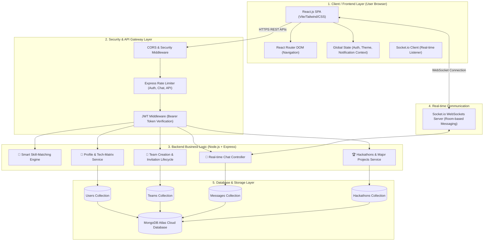

# 🏛️ TeamZen System Architecture & Technical Specifications

> **TeamZen** is an AI-powered BTech & college student teammate matching, hackathon squad finder, and campus project collaboration platform.
> 🌐 **Live Website:** [teamzenconnect.vercel.app](https://teamzenconnect.vercel.app/)

---

## 📐 System Architecture Diagram



---

## 🛠️ Technology Stack

| Layer | Technology | Purpose |
|---|---|---|
| **Frontend Framework** | React.js (Vite) | Single Page Application UI/UX |
| **Styling & Animations** | Vanilla CSS, Tailwind CSS, Framer Motion | Modern dark theme, glassmorphism UI |
| **Icons & Assets** | Lucide React | Clean UI iconography |
| **State Management** | React Context API | Global authentication & notifications |
| **Backend Runtime** | Node.js (v18+) | Non-blocking I/O event-driven server |
| **Web Framework** | Express.js | RESTful API endpoints & middleware |
| **Real-time Protocol** | Socket.io (WebSockets) | Bi-directional instant chat & notifications |
| **Database** | MongoDB Atlas (Mongoose ODM) | NoSQL document database |
| **Security & Rate Limits**| Express-Rate-Limit, JWT, Helmet | DDoS protection & authentication |

---

## 🧩 Core Architecture Modules

### 1. Smart Skill-Matching Engine
- **Purpose:** Match students with zero skill overlap (e.g., matching a Frontend Dev with a Backend Dev & UI/UX Designer).
- **Algorithm Strategy:**
  - Evaluates user's core tech matrix (`Frontend`, `Backend`, `AI/ML`, `Mobile`, `UI/UX`).
  - Filters by branch (CSE, ECE, IT, ME, EE), year of study, and project domains (SIH, Final Year Major Projects, Startups).

### 2. Security & Rate-Limiting Layer
- **File:** `backend/middleware/rateLimiter.js`
- **Auth Limiter:** Protects `/api/auth` login and signup from brute-force scripts.
- **Chat Limiter:** Prevents spam in WebSocket & HTTP chat routes.
- **API Limiter:** Protects general database queries from excessive polling.

### 3. Real-time Communication Architecture
- **Room-Based Sockets:** Each team workspace generates a unique `teamId` socket room.
- **Event Listeners:**
  - `join_room`: Joins verified team members to active socket channel.
  - `send_message` / `receive_message`: Instant broadcast of messages without page reload.

---

## 🌐 Deployment Infrastructure

```
[ Domain: teamzenconnect.vercel.app ]
                 │
                 ├──► Frontend: Vercel Edge Network (Global CDN)
                 │
                 ├──► Backend API: Render / AWS EC2 (Node.js Engine)
                 │
                 └──► Database: MongoDB Atlas Cloud Cluster
```

---

## 🔐 Intellectual Property & Ownership Notice

Copyright © 2026 Mukul Kumar. All Rights Reserved.  
Architected and developed by Mukul Kumar (KNIT Sultanpur). Unauthorized academic submission, cloning, or commercial reproduction is strictly prohibited.
